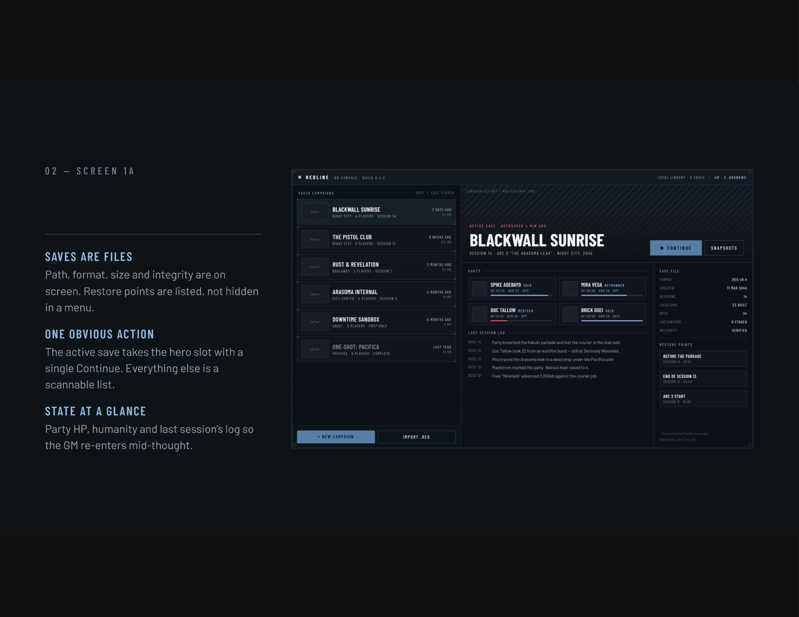

# Redline

A standalone desktop GM console for Cyberpunk RED, built as a single Godot 4.7
project. Its workspaces cover the campaign library, City map, campaign notes and
beats, isometric combat locations, NET architectures, a garage and chases,
character Forge, and markets.

No server, sidecar, API, or network connection is required. Rules, campaign
editing, Lifestyle month closing, and undo/redo all run in GDScript. Campaigns
are portable `.red` files stored on disk.

An optional FastAPI service and container are included for a persistent cloud
session. `POST /encounter/month-end` performs the same in-game month close as
one atomic operation and `/ws` broadcasts the resulting campaign state. It bills
from the same `catalog/lifestyle.json` the app does, and both suites are held to the
same cases in `catalog/lifestyle_cases.json`, so the two implementations of one rule
cannot drift quietly.



## Features

**Library** — lists campaign saves with real file size, format version, and
checksum-verified integrity. The active save shows party status, the latest
session log, and restore points.

**City** — Night City as hover-inspectable zone plates. Each reports who holds
it, what it is, danger, population, law response and net density. Diamond
markers flag zones carrying open job hooks.

Zones are campaign data, not a fixed list. Draw a new one corner by corner
straight onto the map and it becomes an area with the same fields as every
built-in district, ready to fill in. The Areas tab lists them all with Edit and
Delete on each; deleting a zone also removes the job hooks that pointed at it,
and says so before it does. The eight Night City districts are only the seed —
a campaign saved before zones were editable is migrated on open, keeping any
overrides it already carried.

What a zone occupies is editable too, not just what it says. **Reshape on the
map** puts handles on its corners: drag one to move it, click a cross on an edge
to add a corner there, right-click a corner to remove it, or drag inside the
shape to slide the whole plate — name included. Three corners is the floor. When
you finish, every pin is re-checked against the new boundary, so a district that
grew over a clinic now claims it.

Points of interest are pins dropped inside those zones — a clinic, a fixer's
booth, a corp tower. Click one to keep its name, kind, notes, and linked-board
information open in the rail. Drag it to relocate it; its containing zone is
updated automatically when it crosses a boundary. A pin can link to a location:
pick an existing board or build a fresh one on the spot. A linked pin draws
filled and offers its board from the information rail; an unlinked one draws
hollow, because it is a note on the map rather than somewhere the party can
walk into. The Places tab lists them all. Deleting a zone re-homes its pins
rather than deleting them — a place the party knows about does not stop existing
because the GM redrew a boundary.

**Upload map** puts the GM's own image behind those plates. It is normalized to
PNG, stored inside the campaign save, and drawn as a *backdrop* rather than a
separate mode — zones, pins and reshaping all keep working on top of it, so a
zone drawn over a real landmark stays on that landmark. A slider sets how
strongly it reads, and `M` hides it. A campaign carrying label-only zones from
the earlier annotation tool has them adopted into `areas` on open, so they gain
the district fields instead of being dropped.

The in-world clock, date, shift, and weather are campaign state. Crossing a
month boundary prompts the GM through every player character's selected
Lifestyle and available cash before billing the upcoming month. **Close month**
starts the same confirmation flow explicitly. A nearby **Add free-time Hustle**
button lets the GM choose one, several, or all eligible PCs. Each selected PC
rolls their Role-and-Rank Hustle and gets paid while the shared campaign clock
advances the required seven days only once.

**Notes / Beats** — the header's **GM Window** button opens a separate native OS
window for private campaign notes and a basic campaign flowchart. It is not part
of the main Redline viewport, so streaming or recording only the main application
window keeps GM material off-stream. On Windows and macOS it also requests OS
capture exclusion as an extra safeguard; full-desktop capture tools can vary, so
main-window capture remains the reliable setup. Add beats, track
planned/active/complete/skipped status, write scene notes, link beats into
possible paths, and drag cards around the canvas. Notes, links, and positions are
saved inside the portable campaign.

**Player Display** — a second native OS window for the table's own screen, meant
for the monitor or television they are looking at. Unlike the GM Window it asks
for no capture exclusion: it is meant to be seen.

What reaches it is decided by one pure filter and nothing else, so a screen that
is handed a payload can only draw the payload. By default the table gets
positions, names and turn order. It does not get an enemy's exact HP — only a
word for it, and a bar rounded to quarters so the bar cannot be read back as a
number — and it does not get the arithmetic behind a DV, which says what the
cover was worth and what the target's armor is. Two toggles in the Location rail
hand over either. A unit marked hidden is dropped from the payload rather than
flagged inside it, and it leaves the turn order with the board.

**Location** — provides an isometric encounter board with tile, prop, and unit
placement, initiative, combat resolution, cover raycasts, and exact event-based
undo. During setup, tokens can be dragged directly around the board and the
selected character can make Skill Checks with modifiers and a DV before anyone
rolls initiative.

Once initiative is rolled, a move is a Move Action rather than a free drag, and
it goes into the same event log a shot does. **Undo** and **Redo** therefore
walk tokens back across the board as exactly as they walk damage back off a
sheet, and each button names what it would take back before it is clicked —
"Take back Spike Adebayo's move to (7, 4)". Undoing an action also returns the
turn it cost, so a shot taken back leaves the character with their Action again.

Each turn carries one Action and one Move Action, and the rail prints the whole
budget with the reason beside anything unavailable — `Empty`, `Jammed`, `Action
spent`, `Too far` — rather than greying a control out and leaving the GM to
guess. Attempting one anyway raises a banner with the reason in full and the way
out of it. Turn order and the action budget are rulings a table can waive, so
that banner also offers **Do it anyway**; an empty magazine or a jammed weapon
is not, so it does not. Moving shows the reach of one Move Action as a ring on
the board, and a cell beyond it lights red under the cursor before it is
clicked.

**Reloading is an Action**, as it is in the book, so it spends the turn: a
character who reloads shoots on their next turn, not this one. Clearing a jam
costs the same.

**Netrun** — the ladder a Netrunner runs down. Architectures are campaign data:
roll one at a difficulty and edit its floors, or build one floor at a time.
Passwords, Files, Control Nodes and ICE, with the runner's position, a budget of
NET Actions per turn set by their Interface rank, the trace, and exact undo — a
derezzed program comes back at the REZ it had, and the action that killed it
comes back with it. The ICE is homebrew placeholder, exactly as the combat
tables are.

**Garage** — vehicles, and the chase they exist for. A vehicle is modelled as an
actor, SDP where a person has HP and SP where a person has armor, so a car takes
fire through the same rules a Solo does. The gap is the whole state of a chase:
open it far enough and the quarry is gone, close it past alongside and they are
run down. Each side commits a manoeuvre before either rolls, and a manoeuvre buys
its edge by risking something. A garaged vehicle also joins the Location screen's
cover palette, because a car parked on a board is cover with a wreck value.

**Forge** — edits PCs, NPCs, and mook templates. Players can choose any of the
ten Roles, configure Role Ability ranks and specialty/allocation points, and
build a sheet from the complete Skill catalog. Role Ability and Skill Checks
accept situational modifiers and use the same exploding-10/fumbling-1 d10 rules
as combat. The Cyberware tab attaches owned
implants to compatible body parts, applies their Humanity loss on installation,
and leaves that loss in place when an implant is detached. The Gear tab can
transfer cash and carried items directly between any two characters and can run
the Role- and Rank-based weekly Hustle, advancing the campaign clock by the
required seven days. Alongside stats, skills, gear, Humanity, armor, and cover,
each character can carry cash and one of the four Lifestyle levels:

- Kibble — 100eb/month
- Generic Prepak — 300eb/month
- Good Prepak — 600eb/month
- Fresh Food — 1,500eb/month

An affordable month close deducts the cost and records the paid-through month.
An unaffordable payment never makes cash negative; it records the balance and a
seven-day grace period instead.

**Downtime** — beside the Hustle, the other things a week off is for: a Facedown
opposing COOL and Reputation, resting up with or without a medic attending,
buying Humanity back a week at a time, building something in a workshop, and
leaning on a Fixer for what the street has. Each advances the campaign clock by
whatever it actually took.

**Wounds and Death Saves** — a character at zero HP is on a clock. Wound state
is read off HP and costs its penalty on every Action, attack and defence alike;
the Death Save ladder gets harder every time it is rolled; and there are three
ways off it — stabilise, heal, treat the injury. All of it undoes exactly, and
a separate button writes the results back onto the sheets, since an encounter is
a scratch copy that is often replayed before it counts.

**Market / Night Market** — top-level screens that buy from the application-wide
item database onto the selected character. Market exposes the entire database;
an Operator Rank 5+ Fixer can organize a Night Market whose rolled stock is saved
with the campaign and available to every character. Rank 9+ also seats its
Midnight Market.

**Item Workshop** — available from the starting library even before a campaign
is opened. Browse every built-in or custom item, read its description, and make
persistent variations by changing price and type-specific stats such as weapon
damage dice and flat damage, armor SP, or cyberware Humanity loss. Built-ins live
in `catalog/items.json` and custom variants in `user://item_variants.json`, outside
portable campaign saves.

**Assistant** — a rules reference over the rulebook PDFs a GM legally owns. Ask
a question in table language and get a short answer that names the file and PDF
page it came from, or an explicit "the active books did not establish that". It
searches only the books the open campaign has made active, and it never rolls,
never does combat arithmetic, and never answers from what the model happens to
remember about Cyberpunk RED. See **Rules assistant** below.

## Finding things, and not losing them

**Search** — `Ctrl+K` opens one field over the whole campaign: characters,
zones, places, job hooks, beats, the session log, boards, architectures,
vehicles and the item catalog. Every result carries where it lives, so taking
one navigates and selects together.

**Autosave** — a complete `.red` is written beside the save while there is
anything to lose, under a suffix that keeps it out of the library listing.
Saving discards it. Opening a campaign that did not close cleanly offers the
unsaved work rather than applying it, and says how old it is; recovering loads
it as unsaved changes and leaves the file on disk alone until you save.

**Restore points** — named copies of the campaign, kept in a folder beside it,
taken by hand or by starting a session. Restoring loads as unsaved changes, and
the list of restore points survives the trip.

**Sessions** — starting one counts it, logs it, and takes a restore point.
Ending one does the same on the way out. The session log also takes a line by
hand, for what happened at the table.

**Keys and display** — `?` lists every shortcut, from the same table the app
binds them from, and carries the two display preferences that answer the same
question: interface size, for a console read across a room rather than at a
desk, and reduce motion. Both are per-user application data rather than campaign
state.

Screens are kept alive between visits rather than rebuilt, so a fight in
progress survives a trip to the Market — along with scroll position, selection,
and the City's pan and zoom.

## Rules and owned content

No sourcebook pages or extracted images ship with Redline. The built-in combat
table is a homebrew placeholder so a fresh install can resolve a fight. A GM
who owns a map image can import it through the City screen; the image remains
inside their local campaign save.

The combat resolver handles exploding and fumbling d10s, defender-wins ties,
armor ablation, critical injuries, and cover. Each action records its exact
inverse so undo restores previous state structurally. Moves, initiative and the
end of a turn are recorded the same way, so undo covers the whole of a round
rather than only the damage in it.

Nothing in an encounter is refused by crashing. Every action is checked first,
and a refusal is a printable answer — a code, the sentence the GM reads, the
hint naming the way out, and whether it is a ruling the table may waive — which
the screen shows rather than an assertion.

## Running it

Open `project.godot` in Godot 4.7, or run:

```bash
godot --path .                # run the app
./run-tests.sh                # headless logic suite
./run-assistant-tests.sh      # assistant helper suite and the release audit
./run-screens.sh              # every screen, and both native windows (needs Xvfb)
./run-shots.sh                # render every screen to .shots/ (needs Xvfb)
```

`run-tests.sh` proves the rules hold; `run-screens.sh` proves the screens that
use them draw, and that the paths a GM clicks — rolling initiative, taking a
shot, opening a run, starting a chase, searching the campaign — still work end
to end. Both run in CI on every push.

Desktop builds come from the committed `export_presets.cfg`:

```bash
godot --headless --path . --export-release Linux    # or Windows, or macOS
```

The release workflow does the same on a tag, builds the assistant helper beside
it, and runs the export audit over the result.

Both scripts accept `GODOT=/path/to/godot`. The test script performs the import
pass required to register global GDScript classes and then runs the headless
suite. Screenshot tests require a graphical renderer or Xvfb.

## Private Night City map

The sourcebook and map are deliberately ignored by Git. With a user-owned PDF
mounted read-only, extract the largest embedded image (optionally constrain the
search with `--page N`):

```bash
python scripts/extract_night_city_map.py \
  --pdf "/input/Cyberpunk Red.pdf" \
  --output "data/maps/night_city_2045.png"
```

Install the extraction-only dependencies with `python -m pip install -r
requirements.txt`. The City screen loads the resulting RGB-compatible PNG at
runtime, preserves its aspect ratio, and toggles it with **M** or **Map [M]**.
When absent, the built-in map remains usable.

The committed `data/.gdignore` prevents Godot from trying to import private
runtime tables as translation catalogs. If the project was previously opened
with extracted tables present, close Godot and remove the `.godot/` directory
once to clear the old failed import records; Godot will rebuild that cache.
The City screen loads that RGB-compatible PNG at runtime, preserves its aspect
ratio, and toggles it with **M** or **Map [M]**. When absent, the built-in map
remains usable. For cloud use, `docker compose up --build` provides persistent
`/data` campaign storage, a writable map mount, a read-only sourcebook mount,
and the API health check. Set `SOURCEBOOK_PDF` to the host PDF path.

## Layout

```text
project.godot        one Godot project with the Store autoload
scenes/              app and screenshot-runner scenes
scripts/
  app.gd             shell, screen routing, shortcuts, both native windows
  rules/             dice, resolver, events, tables, Lifestyle billing,
                     mortality, netrun, vehicles, downtime, encounter tables
  campaign/          .red container, schema, store, fixtures, autosave,
                     restore points, search
  encounter/         initiative, rounds, turns, netrun runs, chases,
                     the player-facing filter
  city/              zone data, the Night City seed, map images, the map view
  board/             the isometric board
  screens/           library, item workshop, city, location, netrun, garage,
                     forge, markets, assistant, player display
  assistant/         the client that runs and calls the local helper
  ui/theme.gd        palette, fonts, widget factories
assistant/           the local rulebook helper: extraction, index, vault, agent
tests/               headless runner and suites
tests/assistant/     the helper's own suite, run by pytest
docs/mockups/        visual design references
catalog/items.json   homebrew placeholder item catalog (shipped, packed into builds)
catalog/lifestyle.json  the Lifestyle table both the app and the service bill from
data/items_local.json  rulebook-derived catalog, git-ignored, replaces the above
```

## Private item catalog

`catalog/items.json` ships **homebrew placeholders**, exactly as `tables_default.gd`
does for the rules tables, so the app boots with a usable catalog. It sits outside
`data/` because `data/.gdignore` keeps Godot from importing the extracted tables,
and an ignored directory is skipped by the export scan too — anything under it is
missing from an exported build. Its weapon and
armor names and stats deliberately match the rows in `tables_default.gd`, so a
purchased weapon resolves the same way its table row does.

A GM who owns the rulebook can build their own catalog from their own copy:

```bash
python scripts/extract_items.py --pdf "/input/Cyberpunk Red.pdf"
```

That writes `data/items_local.json`, which is git-ignored and, when present,
replaces the placeholders at runtime rather than sitting beside them as
near-duplicates. Book-derived data is never packed into a build, so to use a local
catalog with an exported Redline, copy that file to `items_local.json` in the
user data directory (`%APPDATA%\Godotpp_userdata\Redline` on Windows).
The Market header shows which catalog is loaded. Every row is
validated on load — an unknown weapon type, an autofire rating on a weapon with
no autofire range band, a bad armor location or an unknown cyberware body part is
dropped with a warning instead of asserting later inside the resolver.

## Rules assistant

No sourcebook ships with Redline, so the assistant starts empty. A GM imports
the PDFs they own into an installation-wide library, chooses which of them each
campaign plays with, and supplies their own Anthropic API key.

**Rulebook Library** — Import PDF copies the file into Redline's private
application-data folder, so moving the original out of Downloads later breaks
nothing. Each book is identified by the SHA-256 of its bytes, so the same file
imported twice is recognised as the same book whatever it was renamed to. Text
is extracted page by page and indexed locally into SQLite: full-text search plus
a small deterministic local vector, with no second cloud account and no model
download. An encrypted or scanned PDF is refused with the reason rather than
indexed into something that answers nothing.

**Campaign selection** — A campaign stores only the IDs of its active books, in
the order the GM arranged them. Retrieval is filtered to those IDs in SQL, so a
campaign can never read a passage — or show a citation — from a book it has not
enabled. A book this machine does not have is reported as unavailable rather
than dropped from the save, because the GM who owns it still resolves it on
theirs.

**Asking** — Claude gets one tool: search across the active books. Each passage
it is handed carries a marker, and it cites by marker. The helper then rebuilds
every citation from the passages that request actually retrieved, so a filename
or page number the model wrote itself cannot reach the screen. An answer with no
surviving citation is not shown at all; the GM is told the books did not settle
it.

**Privacy** — Books, extracted text, indexes and question history stay in
per-user application data. The API key lives in the operating-system credential
vault, never in a `.red` file, a settings file, a log, a process argument, or an
export. Asking a question sends the question and the passages found for it to
Anthropic, using the GM's key; the first-use disclosure in the Assistant tab
says so before the first question. Nothing else about the campaign — characters,
notes, beats, clock — is ever sent. `scripts/audit_export.py` fails a release
that carries a book, an index, extracted text, or a credential.

```text
Redline application data/assistant/
  books/         imported PDFs
  index/         extracted chunks and the SQLite index
  history/       local per-campaign question history
  library.json   non-secret book metadata
OS credential vault    the GM's Anthropic API key
campaign.red           active_rulebook_ids, and nothing else
```

### The helper process

Extraction, indexing, the vault, retrieval, and the Anthropic request all live
in a small Python helper that ships as one executable, so a GM never installs
Python. Godot starts it on demand, writes it a freshly generated session token
over the pipe — never on the command line — and reads back the loopback port it
bound. It listens on `127.0.0.1` only, requires that token on every request, and
exits when Redline closes the pipe, so a crash leaves no orphan.

Build and verify it with the frozen binary's own self test:

```bash
python -m pip install -r assistant/requirements-dev.txt
python assistant/packaging/build_helper.py     # dist/redline-assistant[.exe]
```

Windows is the first packaging target, since that is where a GM is least likely
to have Python; the same command builds the macOS and Linux helper. In a
development checkout with those requirements installed, Godot runs the helper
from source instead, so no build step is needed to work on it.

## Save format

A `.red` file is a zip containing:

```text
manifest.json          version, timestamps, SHA-256 and size per entry
campaign.json          identity, clock, map/zones, GM notes and beat flow,
                       NET architectures, the garage, restore points
roster.json            characters, cash, Lifestyle state, wounds and Reputation
locations/<id>.json    board layouts
assets/map.png          optional normalized GM-uploaded map
```

The library reads only the manifest and campaign metadata when listing saves.
Opening a save verifies every entry against the recorded SHA-256 checksum.

## License

MIT, see `LICENSE`. Cyberpunk RED is a trademark of R. Talsorian Games; Redline
is an unaffiliated tool and includes none of the sourcebook's copyrighted
content.
